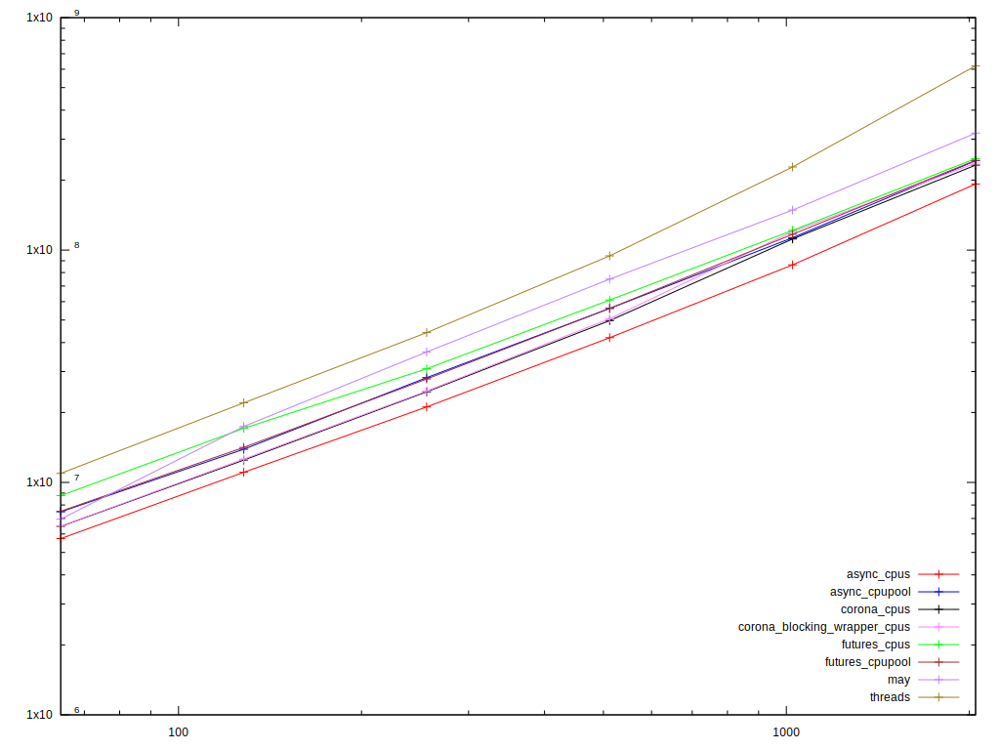

# Benchmark of different Async approaches in Rust

The story about Rust's async is still a bit in flux. There's a bunch of
libraries with their pros and cons and different approaches. Even I'm a bit to
blame for that, as I'm writing one of my own, called
[Corona](https://crates.io/crates/corona).

While the goal of Corona explicitly is not top performance (comfort of use,
bridging of different concepts and being a good Rust citizen is ‒ but this is a
topic for another day, probably after I release the next version), I wondered
how terrible its performance might be, compared to others.

Also, I was hearing a lot of rumors stating this or that library being faster
than all the rest or that you can't get a decent performance without a
work-stealing scheduler so Rust is doomed, because it can't have stack-full
coroutines and work-stealing between threads at the same time and still stay
being Rust (note that it can provide either of the two and still not break the
protection against data races).

So I decided I want to measure it and see how it goes. I wrote a little
benchmark, which lives in corona's
[repository](https://github.com/vorner/corona/tree/master/benchmarks).

## Warning about benchmarks

Benchmarks usually measure artificial scenarios, compare apples with oranges,
are very hardware sensitive and generally lie. The one I made is no different.

This means you probably shouldn't put too much trust into the results I measured
or base important decisions on the outcomes. If you measure it on your computer,
you're very likely to get something different. It is possible the benchmarks
measure something that makes no sense at all.

Also, there are some implementation problems with the benchmark ‒ sometimes it
gets stuck (some implementation details lead to wrong estimate for number of
iterations the framework runs, choosing an insane number of them), it needs a
huge amount of parallel TCP connections and there's just about no error
handling. If you get strange backtraces or wildly out-of-line results, read the
[README](https://github.com/vorner/corona/blob/master/benchmarks/README.md) and
re-run them.

Furthermore, I wrote each approach as naturally as possible, not trying any
tricks to speed it up. If you find any obvious mistake that makes one of the
approaches needlessly slow, I'll be glad to hear it.

Anyway, there is a bit of truth to every lie, not excluding benchmarks, and they
are interesting, so I decided to share what I measured.

## What the benchmark does

The goal was to measure how fast a server written with each library would be,
given some IO heavy parallel workload. Therefore, each measurement has the same
client, but different server.

The client makes configurable amount of parallel TCP connections to the server
and then exchanges messages of fixed size back and forth with the server several
times, on each connection in turn. The client is run in multiple threads, so the
server is kept busy. To make the measurement easier, the client runs on the same
computer as the server ‒ this unfortunately means it competes with the server
for CPU power.

One iteration of the benchmark is actually processing all the parallel
connections from start to end, configurable number of times.

Most of the parameters are configurable by environment variables, so it's
possible to compare how each solution scales based on the number of parallel
connections, number of messages exchanged per connection, etc.

I made a graph with different number of parallel connections. It is probably the
most significant parameter and having graphs in more than 2 dimensions is
confusing, so I chose that one. You're of course free to make your own based on
different parameters. The other parameters were kept on the defaults.

## Different servers

There are different servers implemented. Each one is run in three variants.

* One that has a single acceptor task on a single main thread. For solutions
  that are naturally single-threaded, this means the whole server runs on just a
  single thread. The naturally multi-threaded approaches are configured to use
  all CPUs.
* One with `_many` suffix, with configurable number of acceptors and main
  threads. The default is 2. This makes even the naturally single-threaded
  solutions use multiple threads to do the work.
* One with `_cpus` suffix, which runs as many of these main threads as there are
  CPUs.

The server implementations are:

* `threads`: Naïve implementation, starting a new thread for each connection.
* `futures`: Approach with [`tokio`](https://crates.io/crates/tokio-core) and
  [futures](https://crates.io/crates/futures) combinators. This is naturally
  single-threaded.
* `async`: Also with `tokio`, but the task to run is built using the async-await
  notation provided by the
  [`futures-await`](https://crates.io/crates/futures-await) crate, getting
  somewhat friendlier synchronous feeling of the code.
* `*_cpupool`: Similar to the above two, but the created task is posted into a
  [`futures-cpupool`](https://crates.io/crates/futures-cpupool) worker pool.
  This turns the single-threaded approaches to multi-threaded, but keeps the IO
  polling on the main threads.
* `corona`: The corona library with async-await notation.
* `corona_blocking_wrapper`: The corona library, with wrappers around async IO
  streams to mimic blocking API.
* [`may`](https://crates.io/crates/may): The may coroutine library, which tries
  to port Go semantics into Rust.

## What I expected

* The async and futures approaches to result in very similar performance.
* Corona to outright lose (I haven't done any optimisation yet, though I have
  some planned).
* The `_many` and `_cpu` approaches to speed up the single-threaded approaches,
  but not to help much on the naturally multi-threaded ones.
* `may` to prove its claim to be very fast, faster than `tokio`-based
  approaches.
* With doubling the number of parallel connections to also double the time
  needed to process them. On the base line, there's twice as much work to do in
  each batch. But there's memory caching ‒ with more connections, they're less
  likely to fit into the cache, so it should make things even slower. On the
  other hand, the fact the kernel queue is processed in larger chunks (as there
  are probably more events waiting with bigger parallelism) might make it
  faster.

## What I got

The shown benchmarks are from a 8-core AMD machine (AMD FX-8370) on Linux
4.13.11. When trying an Intel with hyperthreading, the results were a bit
different, but I don't have the graph here. I'd like to run it on some other
architecture (eg. ARM) as well.

* The competition is quite tight. I expected bigger differences. There's
  probably no more IO-heavy workload than this (because there's no other work
  than IO in the benchmark), so the real-life difference is likely to be even
  smaller. Therefore, unless you need ridiculous amount of parallel connections
  (hundreds of thousands), you probably don't have to care about performance
  when choosing your library. But then it would be more about the amount of
  memory used than the actual scheduling costs anyway (which rules out anything
  stack-full ‒ `corona`, `may` and threads).
* I was right about the `_many` and `_cpus` being faster on single-threaded
  approaches. However, in general, the naturally multi-threaded approaches were
  sometimes made a bit slower by introducing multiple acceptors.
* While `may` is faster than single-thread solutions (which is to be expected,
  as `may` is naturally multi-threaded), it doesn't do better than other
  multi-threaded approaches or single-threaded ones run in multiple instances
  and is often slower than them. Even corona outperforms it when allowed to use
  all CPUs.
* Corona is only a bit slower than the bare-bones `async` and `futures`
  approaches. Considering it also uses `tokio` under the hood, but adds full-stack
  coroutines on top of that *and* there are still some optimisations worth
  trying out, it sounds better than I expected.
* For reasons I couldn't guess, the `futures` approach is somewhat slower than
  `async`, even though they both produce a state machine that is fed to `tokio`.
  Maybe the `async` style is easier for the optimiser to reason about or the
  resulting state machine is smaller.
* The slowest solution, especially for larger number of connections, are the
  threads. So, when building a massively parallel server, one thread per
  connection isn't a very good solution for both memory *and* performance
  reasons.
* The fastest solutions are the ones that *don't* have any work stealing. So in
  that sense, work-stealing scheduler isn't always a win (though I can imagine
  situations where it is). The work-stealing based solutions (`may` and
  `cpupool` ones) were not as much worse on a system with hyperthreading as on
  this one with real CPU cores, but they still didn't outperform the approaches
  with fully separated threads.
* The double slowdown with doubling the parallelism is mostly true, with some
  jumps (probably caused by the cache hierarchy ‒ sometimes the smaller number
  of contexts fit into one level of cache, but the bigger one doesn't).

## Finally, the results

The raw results from a run with the default parameters:

```
test async_cpus                   ... bench:  11,057,663 ns/iter (+/- 1,546,785)
test corona_cpus                  ... bench:  12,483,281 ns/iter (+/- 1,547,974)
test corona_blocking_wrapper_cpus ... bench:  12,601,478 ns/iter (+/- 1,368,466)
test async_cpupool                ... bench:  13,895,220 ns/iter (+/- 2,412,441)
test async_cpupool_many           ... bench:  14,118,352 ns/iter (+/- 3,170,100)
test futures_cpupool              ... bench:  14,161,521 ns/iter (+/- 3,190,636)
test async_many                   ... bench:  14,304,595 ns/iter (+/- 1,966,185)
test futures_cpupool_many         ... bench:  14,398,131 ns/iter (+/- 2,722,364)
test futures_cpupool_cpus         ... bench:  16,162,328 ns/iter (+/- 204,181,954)
test async_cpupool_cpus           ... bench:  16,449,300 ns/iter (+/- 7,062,024)
test futures_many                 ... bench:  16,857,098 ns/iter (+/- 3,664,201)
test may_cpus                     ... bench:  16,940,574 ns/iter (+/- 3,652,612)
test futures_cpus                 ... bench:  17,100,394 ns/iter (+/- 207,223,624)
test may                          ... bench:  17,407,826 ns/iter (+/- 204,029,107)
test may_many                     ... bench:  17,976,177 ns/iter (+/- 2,738,411)
test corona_many                  ... bench:  19,673,364 ns/iter (+/- 2,028,918)
test corona_blocking_wrapper_many ... bench:  20,098,071 ns/iter (+/- 84,982,750)
test threads                      ... bench:  22,011,601 ns/iter (+/- 1,645,368)
test threads_many                 ... bench:  22,439,402 ns/iter (+/- 2,497,508)
test async                        ... bench:  25,129,522 ns/iter (+/- 1,948,456)
test threads_cpus                 ... bench:  26,045,198 ns/iter (+/- 5,311,040)
test futures                      ... bench:  27,259,033 ns/iter (+/- 3,447,498)
test corona                       ... bench:  34,898,721 ns/iter (+/- 204,006,257)
test corona_blocking_wrapper ... bench: 35,851,174 ns/iter (+/- 76,716,240)
```

The graph was really crowded, so it contains only the best variant of each
method.

It is in logarithmic scale, the number of parallel connections is on the `x`
axis, the time per iteration (in nanoseconds) on `y`.


